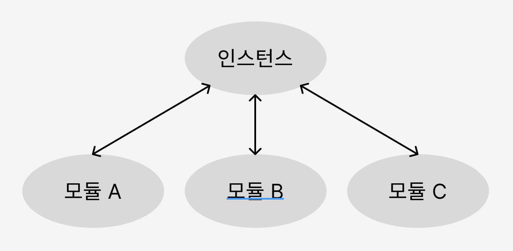

# 디자인 패턴

프로그램을 설계할 때 발생한 문제점들을 객체 간의 상호 관계 등을 이용하여 해결할 수 있도록 하나의 '규약' 형태로 만들어 놓은 것

## 싱글톤 패턴

하나의 클래스에 오직 하나의 인스턴스만 가진다. 보통 데이터베이스 연결 모듈에 많이 사용한다. 하나의 인스턴스를 만들어 놓고 해당 인스턴스를 다른 모듈들이 공유한다.

인스턴스 생성시 비용이 줄어든다는 장점이 있지만, 의존성이 높아진다는 단점이 있다.

> 인스턴스는 일반적으로 실행 중인 임의의 프로세스, 클래스의 현재 생성된 오브젝트를 가리킨다. 객체(오브젝트)의 인스턴스는 데이터베이스나 SGA, 백그라운드 프로세스등 광범위한 컴퓨터시스템 자원의 접근에 할당된 물리 메모리의 일부를 가리킨다.
> 
> [by. Wikipedia](https://ko.wikipedia.org/wiki/%EC%9D%B8%EC%8A%A4%ED%84%B4%EC%8A%A4)



### 자바스크립트의 싱글톤 패턴

아래는 자바스크립트에서 싱클톤 패턴을 구현한 모습이다. 자바스크립트에서는 리터럴 `{}` 또는 `new Object`로 객체를 생성하게 되면 다른 어떤 객체와도 같지 않기 때문에 이 자체만으로 싱글톤 패턴을 구현할 수 있다.

```javascript
const obj = {
  a: 27
}

const obj2 = {
  a: 27
}

console.log(obj === obj2) // false
```

`new Object` 라는 클래스에서 나온 단 하나의 인스턴스니 어느 정도 싱글톤 패턴이라 볼 수 있지만, 실제 싱글톤 패턴은 아래와 같이 구성된다.

```javascript
class Signleton {
  constructor() {
    if (!Signleton.instance) {
      Signleton.instance = this
    }
    return Signleton.instance
  }
  
  getInstance() {
    return this
  }
}

const a = new Signleton()
const b = new Signleton()
console.log(a === b) // true
```

위의 코드는 `Signleton.instance`라는 하나의 인스턴스를 가지는 클래스를 구현한 모습이다. a와 b는 하나의 인스턴스를 가지게 된다.

### 데이터베이스 연결 모듈

싱글톤 패턴은 데이터베이스 연결 모듈에 많이 쓰인다. 데이터베이스 연결시 하나의 인스턴스를 기반으로 하기에 인스턴스 생성 비용을 아낄 수 있다.

### 싱글톤 패턴의 단점

- TDD 할 때 걸림돌이 된다.
  - TDD는 단위 테스트를 주로 하는데, 단위 테스트는 서로 독립적이어야 하며 테스트를 어떤 순서로든 실행할 수 있어야 한다. 반면, 싱글톤 패턴은 미리 생성된 하나의 인스턴스를 기반으로 구현하는 패턴이므로 각 테스트마다 '독립적인' 인스턴스를 만들기 어렵기 때문이다.
- 모듈 간의 결합을 강하게 만들 수 있다.
  - 의존성 주입을 통해 해결할 수 있다.

### 의존성 주입(DI, Dependency Injection)

메인 모듈이 직접 다른 하위 모듈에 대한 의존성을 주기보다는 중간에 의존성 주입자가 이 부분을 가로채 메인 모듈이 간접적으로 의존성을 주입하는 방식이다.

이를 통해 메인 모듈은 하위 모듈에 대한 의존성이 떨어지게 된다. 다른 말로는 `디커플링이 된다` 라고도 한다.

모듈들을 쉽게 교체할 수 있는 구조가 되어 테스팅하기 쉽고 마이그레이션하기도 수월해진다. 애플리케이션 의존성 방향이 일관되고 쉽게 추론할 수 있게 되며, 모듈 간의 관계들이 조금 더 명확해진다는 장점이 있다.

단, 모듈들이 더욱더 분리되어 클래스 수가 늘어나 복잡성이 증가될 수 있으며 약간의 런타임 패널티가 생기기도 한다.

의존성 주입은 **상위 모듈은 하위 모듈에서 어떠한 것도 가져오지 않아야 한다. 또한, 둘 다 추상화에 의존해야 하며, 이때 추상화는 세부 사항에 의존하지 말아야 한다.** 라는 원칙을 지켜주며 만들어야 한다.

---

## 팩토리 패턴

객체를 사용하는 코드에서 객체 생성 부분을 떼어내 추상화한 패턴, 상속 관계에 있는 두 클래스에서 상위 클래스가 중요한 뼈대를 결정하고, 하위 클래스에서 객체 생성에 관한 구체적인 내용을 결정하는 패턴이다.

### 자바스크립트의 팩토리 패턴

간단하게 `new Object()`로 구현할 수 있다.

```javascript
const num = new Object(24)
const str = new Object('abc')
num.constructor.name; // Number
str.constructor.name; // String
```

숫자를 전달하거나 문자열을 전달함에 따라 다른 타입의 객체를 생성한다. 즉, 전달받은 값에 따라 다른 객체를 생성하며 인스턴스의 타입 등을 정한다.

```javascript
class CoffeeFactory {
  static createCoffeee(type) {
    const factory = factoryList[type]
    return factory.createCoffee()
  }
}

class Latte {
  constructor() {
    this.name = 'latte'
  }
}

class LatteFactory extends CoffeeFactory {
  static createCoffee() {
    return new Latte()
  }
}

const factoryList = { LatteFactory }
```

`CoffeeFactory`라는 상위 클래스가 중요한 뼈대를 결정하고 하위 클래스인 `LatteFactory`가 구체적인 내용을 결정하고 있다.

이는 의존성 주입이라고도 볼 수 있다. `CoffeeFactory`에서 `LatteFactory`의 인스턴스를 생성하는 것이 아닌 `LatteFactory`에서 생성한 인스턴스를 `CoffeeFactory`에 주입하고 있기 때문이다.

`static` 키워드를 통해 `createCoffee()` 메서드를 정적 메서드로 선언함으로써 클래스를 기반으로 객체를 만들지 않고 호출이 가능하며, 해당 메서드에 대한 메모리 할당을 한 번만 할 수 있게 된다.

---

## 전략 패턴

정책 패턴이라고도 하며, 객체의 행위를 바꾸고 싶은 경우 직접 수정하지 않고 전략이라고 부르는 **캡슐화한 알고리즘**을 컨텍스트 안에서 바꿔주면서 상호 교체가 가능하게 만드는 패턴이다.

어떤 아이템을 살 때, 카카오페이, 네이버페이 등 다양한 방법으로 결제하듯 결제 방식의 전략만 바꿔서 결제하는 것을 생각하면 된다.

> 프로그래밍에서의 컨텍스트는 상황, 맥락, 문맥을 의미하며 개발자가 어떠한 작업을 완료하는 데 필요한 모든 관련 정보를 말한다.

---

## 옵저버 패턴

주체가 어떤 객체의 상태 변화를 관찰하다가 상태 변화가 있을 때마다 메서드 등을 통해 옵저버 목록에 있는 옵저버들에게 변화를 알려주는 패턴이다.

주체란 객체의 상태 변화를 보고 있는 관찰자이며, 옵저버들은 이 객체의 상태 변화에 따라 전달되는 메서드 등을 기반으로 추가 변화 사항이 생기는 객체들을 의미한다.

주체와 객체를 따로 두지 않고 상태가 변경되는 객체를 기반으로 구축하기도 한다.

옵저버 패턴을 활용한 서비스로 트위터(현 X)가 있다. (새로운 트윗을 옵저버들에게 알려준다.)

또한, 옵저버 패턴은 주로 이벤트 기반 시스템에 사용하며 MVC (Model-View-Controller) 패턴에도 사용된다. 주체라고 볼 수 있는 모델에서 변경 사항이 생겨 update() 메서드로 옵저버인 뷰에 알려주고 이를 기반으로 컨트롤러 등이 작동하는 것이다.

### 자바스크립트에서의 옵저버 패턴

프록시 객체를 통해 구현할 수도 있다.

#### 프록시 객체 

프록시 객체는 어떠한 대상의 기본적인 동작(속성 접근, 할당, 순회, 열거, 함수 호출 등)의 작업을 가로챌 수 있는 객체를 뜻하며, 자바스크립트에서의 프록시 객체는 두 개의 매개변수를 가진다.

- target: 프록시할 대상
- handler: target 동작을 가로채고 어떠한 동작을 할 것인지 설정되어 있는 함수

아래는 프록시 객체를 통해 옵저버 패턴을 구현한 예제이다.

```javascript
function createReactiveObject(target, callback) {
  const proxy = new Proxy(target, {
    set(obj, prop, value) {
      if (value !== obj[prop]) {
        const prev = obj[prop]
        obj[prop] = value
        callback(`${prop}가 [${prev}] >> [${value}] 로 변경되었습니다.`)
      }
      return true
    }
  })
  return proxy
}

const a = {
  "형규": "솔로"
}

const b = createReactiveObject(a, console.log)
b.형규 = '솔로'
b.형규 = '커플'
// 형규가 [솔로] >> [커플] 로 변경되었습니다.
```

프록시 객체의 `get()` 함수는 속성과 함수에 대한 접근을 가로채며, `has()` 함수는 `in` 연산자의 사용을 가로챈다. `set()` 함수는 속성에 대한 접근을 가로채는데, `set()` 함수를 통해 속성에 대한 접근을 가로채서 형규라는 속성이 솔로에서 커플로 되는 것을 감시할 수 있었다.

## 프록시 패턴과 프록시 서버

앞에서 설명한 프록시 객체는 디자인 패턴 중 하나인 프록시 패턴이 녹아들어 있는 객체이다.

**프록시 패턴**은 대상 객체에 접근하기 전 그 접근에 대한 흐름을 가로채 해당 접근을 필터링하거나 수정하는 등의 역할을 하는 계층이 있는 디자인 패턴이다.

이를 통해 객체의 속성, 변환 등을 보완하며 보안, 데이터 검증, 캐싱, 로깅에 사용한다.

**프록시 서버**는 서버와 클라이언트 사이에서 클라이언트가 자신을 통해 다른 네트워크 서비스에 간접적으로 접속할 수 있게 해주는 컴퓨터 시스템이나 응용 프로그램을 가리킨다. 주로 Node.js 서버 앞단의 프록시 서버로 활용되는 nginx 등이 있다.

### nginx

nginx 를 프록시 서버로 둬서 실제 포트를 숨길 수 있고 정적 자원을 gzip 압축하거나, 메인 서버 앞단에서의 로깅을 할 수도 있다.

> 버퍼 오버플로우
> 
> 버퍼는 보통 데이터가 저장되는 메모리 공간으로, 메모리 공간을 벗어나는 경우를 말한다. 이때 사용되지 않아야 할 영역에 데이터가 덮어씌워져 주소, 값을 바꾸는 공격이 발생하기도 한다.

> gzip 압축
> 
> gzip 압축을 하면 데이터 전송량을 줄일 수 있지만, 압축을 해제했을 때 서버에서의 CPU 오버헤드도 생각해서 gzip 압축 사용 유무를 결정해야 한다.

### CloudFlare

전 세계적으로 분산된 서버가 있고 이를 통해 어떠한 시스템의 콘텐츠 전달을 빠르게 할 수 있는 CDN 서비스이다.

CloudFlare 는 웹 서버 앞단에 프록시 서버로 두어 DDOS 공격 방어나 HTTPS 구축에 쓰인다.

> CDN (Content Delivery Network)
> 
> 각 사용자가 인터넷에 접속하는 곳과 가까운 곳에서 콘텐츠를 캐싱 또는 배포하는 서버 네트워크를 말한다. 이를 통해 사용자가 웹 서버로부터 콘텐츠를 다운로드하는 시간을 줄일 수 있다.

### CORS 와 프론트엔드의 프록시 서버

CORS(Cross-Origin Resource Sharing)는 서버가 웹 브라우저에서 리소스를 로드할 때 다른 오리진을 통해 로드하지 못하게 하는 HTTP 헤더 기반 메커니즘이다.

CORS 에러를 해결하기 위해 프론트엔드에서 프록시 서버를 두기도 한다.

## 이터레이터 패턴

이터레이터(iterator)를 사용하여 컬렉션의 요소들에 접근하는 디자인 패턴이다. 이를 통해 순회할 수 있는 여러 가지 자료형의 구조와는 상관없이 이터레이터라는 하나의 인터페이스로 순회가 가능하다.

### 자바스크립트에서의 이터레이터 패턴

```javascript
const mp = new Map()
mp.set('a', 1)
mp.set('b', 2)
mp.set('c', 3)

const st = new Set()
st.add(1)
st.add(2)
st.add(3)

for (let a of mp) console.log(a)
for (let a of st) console.log(a)

/*
['a', 1]
['b', 2]
['c', 3]
1
2
3
 */
```

분명히 다른 자료 구조인 `set`과 `map`임에도 똑같은 `for a of b`라는 이터레이터 프로토콜을 통해 순회하는 것을 볼 수 있다.

> 이터레이터 프로토콜
> 
> 이터러블한 객체들을 순회할 때 쓰이는 규칙

> 이터러블한 객체
> 
> 반복 가능한 객체로 배열을 일반화한 객체

## 노출 모듈 패턴

즉시 실행 함수를 통해 `private`, `public` 같은 접근 제어자를 만드는 패턴을 말한다. 자바스크립트는 `private` 이나 `public` 같은 접근 제어자가 존재하지 않고 전역 범위에서 스크립트가 실행된다. 그렇기 때문에 노출모듈 패턴을 통해 `private`와 `public` 접근 제어자를 구현하기도 한다.

```javascript
const pukuba = (() => {
  const a = 1
  const b = () => 2
  const public = {
    c : 2,
    d : () => 3
  }
  return public
})()
console.log(pukuba)
console.log(pukuba.a)
// { c: 2, d: [Function: d] }
// undefined
```

a와 b는 다른 모듈에서 사용할 수 없는 변수나 함수이며 `private` 범위를 가진다. c와 d는 다른 모듈에서 사용할 수 있는 변수나 함수이며 `public` 범위를 가진다.

노출모듈 패턴을 기반으로 만든 자바스크립트 모듈 방식으로는 CJS(CommonJS)가 있다.

## MVC 패턴

MVC 패턴은 모델, 뷰, 컨트롤러로 이루어진 디자인 패턴이다. 애플리케이션 구성 요소를 세 가지 역할로 구분하여 개발 프로세스에서 각각의 구성 요소에만 집중해서 개발할 수 있다. 재사용성과 확장성이 용이하다는 장점이 있고, 애플리케이션이 복잡해질수록 모델과 뷰의 관계가 복잡해진다는 단점이 있다.

### 모델

애플리케이션의 데이터인 데이터베이스, 상수, 변수 등을 뜻한다.

### 뷰

inputbox, checkbox, textarea 등 사용자 인터페이스 요소를 나타낸다. 즉, 모델을 기반으로 사용자가 볼 수 있는 화면을 뜻한다.

### 컨트롤러

하나 이상의 모델과 하나 이상의 뷰를 잇는 다리 역할을 하며 이벤트 등 메인 로직을 담당한다. 또한, 모델과 뷰의 생명주기도 관리하며, 모델이나 뷰의 변경 통지를 받으면 이를 해석하여 각각의 구성 요소에 해당 내용에 대해 알려준다.

## MVP 패턴

MVC 패턴으로부터 파생되었으며, MVC에서 C에 해당하는 컨트롤러가 프레젠터로 교체된 패턴이다.

뷰와 프레젠터는 일대일 관계이기 때문에 MVC 패턴보다 더 강한 결합을 지닌 디자인 패턴이다.

## MVVM 패턴

MVC의 C에 해당하는 컨트롤러가 뷰모델로 바뀐 패턴이다.

뷰모델은 뷰를 더 추상화한 계층이며, MVVM 패턴은 MVC 패턴과는 다르게 커맨드와 데이터 바인딩을 가지는 것이 특징이다. 뷰와 뷰모델 사이의 양방향 데이터 바인딩을 지원하며 UI를 별도의 코드 수정 없이 재사용할 수 있고 단위 테스팅하기 쉽다는 장점이 있다.

MVVM 패턴을 가지는 대표적인 프레임워크로는 Vue.js 가 있다.