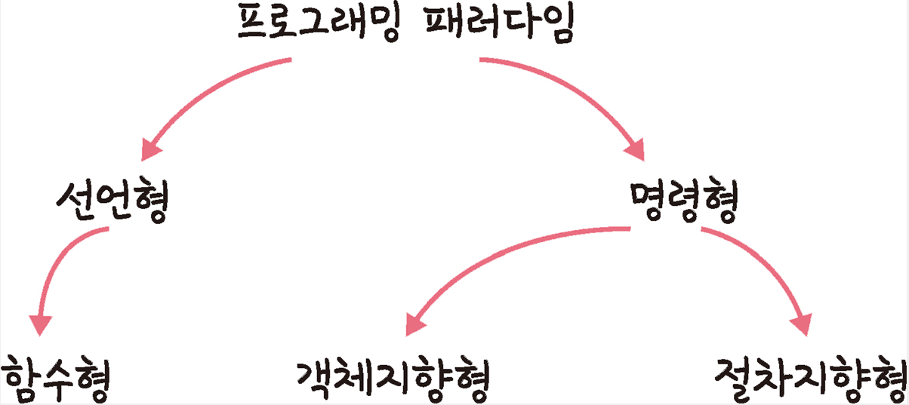

# 프로그래밍 패러다임

프로그래머에게 프로그래밍의 관점을 갖게 해주는 역할을 하는 개발 방법론이다.

객체지향 프로그래밍은 프로그래머들이 프로그램을 상호 작용하는 객체들의 집합으로 볼 수 있게 하는 반면에, 함수형 프로그래밍은 상태 값을 지니지 않는 함수 값들의 연속으로 생각할 수 있게 해준다.

여러 패러다임을 지원하는 언어로는 C++, 파이썬, 자바스크립트가 있으며, 자바의 경우 jdk 1.8부터 함수형 프로그래밍 패러다임을 지원하기 위해 람다식, 생성자 레퍼런스, 메서드 레퍼런스를 도입했고 선언형 프로그래밍을 위해 스트림 같은 표준 API 등도 추가했다.

프로그래밍 패러다임은 크게 선언형, 명령형으로 나누며, 선언형은 함수형이라는 하위 집합을 갖는다. 또한, 명령형은 다시 객체지향, 절차지향으로 나눈다.



## 선언형과 함수형 프로그래밍

선언형 프로그래밍은 '무엇을' 풀어내는가에 집중하는 패러다임이며, "프로그램은 함수로 이루어진 것이다."라는 명제가 담겨 있는 패러다임이기도 하다. 함수형 프로그래밍은 선언형 패러다임의 일종이다.

```javascript
const list = [1, 2, 3, 4, 5, 11, 12]
const ret = list.reduce((max, num) => num > max ? num : max, 0)
console.log(ret) // 12
```

앞의 코드에서 `reduce()`는 배열만 받아서 누적한 결괏값을 반환하는 순수 함수이다. 함수형 프로그래밍은 이와 같은 **순수 함수**들을 블록처럼 쌓아 로직을 구현하고 고차 함수를 통해 재사용성을 높인 프로그래밍 패러다임이다.

### 순수 함수

출력이 입력에만 의존하는 것을 의미한다.

```javascript
const pure = (a, b) => {
  return a + b
}
```

pure 함수는 들어오는 매개변수 a, b에만 영향을 받는다. 만약 a, b 말고 다른 전역 변수 c 등이 이 출력에 영향을 주면 순수 함수가 아니다.

### 고차 함수

함수가 함수를 값처럼 매개변수로 받아 로직을 생성할 수 있는 것을 말한다.

#### 일급 객체

이때 고차 함수를 쓰기 위해서는 해당 언어가 일급 객체라는 특징을 가져야 하며 그 특징은 다음과 같다.

- 변수나 메서드에 함수를 할당할 수 있다.
- 함수 안에 함수를 매개변수로 담을 수 있다.
- 함수가 함수를 반환할 수 있다.

## 객체지향 프로그래밍

객체지향 프로그래밍(OOP, Object-Oriented Programming)은 객체들의 집합으로 프로그램의 상호 작용을 표현하며 데이터를 객체로 취급하여 객체 내부에 선언된 메서드를 활용하는 방식을 말한다. 설계에 많은 시간이 소요되며 처리 속도가 다른 프로그래밍 패러다임에 비해 상대적으로 느리다.

```javascript
const ret = [1, 2, 3, 4, 5, 11, 12]

class List {
  constructor(list) {
    this.list = list
    this.mx = list.reduce((max, num) => num > max ? num : max, 0)
  }
  getMax() {
    return this.mx
  }
}
const a = new List(ret)
console.log(a.getMax()) // 12
```

클래스 List 의 메서드 getMax() 로 list의 최댓값을 반환하였다.

### 특징

#### 추상화

복잡한 시스템으로부터 핵심적인 개념 또는 기능을 간추려내는 것을 의미한다.

#### 캡슐화

객체의 속성과 메서드를 하나로 묶고 일부를 외부에 감추어 은닉하는 것을 말한다.

#### 상속성

상위 클래스의 특성을 하위 클래스가 이어받아서 재사용하거나 추가, 확장하는 것을 말한다. 코드의 재사용 측면, 계층적인 관계 생성, 유지 보수성 측면에서 중요하다.

#### 다형성

하나의 메서드나 클래스가 다양한 방법으로 동작하는 것을 말한다. 오버로딩, 오버라이딩이 있다.

> 오버로딩
> 
> 같은 이름을 가진 메서드를 여러 개 두는 것을 말한다. 메서드의 타입, 매개변수의 유형, 개수 등으로 여러 개를 둘 수 있으며 컴파일 중 발생하는 '정적' 다형성이다.

> 오버라이딩
> 
> 주로 메서드 오버라이딩을 말하며, 상위 클래스로부터 상속받은 메서드를 하위 클래스가 재정의하는 것을 의미한다. 이는 런타임 중 발생하는 '동적' 다형성이다.

### 설계 원칙

객체지향 프로그래밍을 설계할 때는 SOLID 원칙을 지켜주어야 한다.

#### 단일 책임 원칙 (SRP, Single Responsibility Principle)

모든 클래스는 각각 하나의 책임만 가져야 하는 원칙이다.

#### 개방-폐쇄 원칙 (OCP, Open Closed Principle)

유지 보수 사항이 생긴다면 코드를 쉽게 확장할 수 있도록 하고 수정할 때는 닫혀 있어야 하는 원칙이다. 즉, 기존의 코드는 잘 변경하지 않으면서도 확장은 쉽게 할 수 있어야 한다.

#### 리스코프 치환 원칙 (LSP, Liskov Substitution Principle)

프로그램의 객체는 프로그램의 정확성을 깨뜨리지 않으면서 하위 타입의 인스턴스로 바꿀 수 있어야 하는 것을 의미한다. 클래스는 상속이 되기 마련이고 부모, 자식이라는 계층 관계가 만들어진다. 이때 부모 객체에 자식 객체를 넣어도 시스템이 문제없이 돌아가게 만드는 것을 말한다.

#### 인터페이스 분리 원칙 (ISP, Interface Segregation Principle)

하나의 일반적인 인터페이스보다 구체적인 여러 개의 인터페이스를 만들어야 하는 원칙을 말한다.

#### 의존 역전 원칙 (DIP, Dependency Inversion Principle)

자신보다 변하기 쉬운 것에 의존하던 것을 추상화된 인터페이스나 상위 클래스를 두어 변하기 쉬운 것의 변화에 영향받지 않게 하는 원칙을 말한다. 상위 계층은 하위 계층의 변화에 대한 구현으로부터 독립해야 한다.

## 절차형 프로그래밍

절차형 프로그래밍은 로직이 수행되어야 할 연속적인 계산 과정으로 이루어져 있다. 일이 진행되는 방식으로 그저 코드를 구현하기만 하면 되기 때문에 코드의 가독성이 좋으며 실행 속도가 빠르다. 그렇기 때문에 계산이 많은 작업 등에 쓰인다. 단점으로는 모듈화하기가 어렵고 유지 보수성이 떨어진다는 점이 있다.

## 패러다임의 혼합

가장 좋은 패러다임이라는 것은 없다. 비즈니스 로직이나 서비스의 특징을 고려해서 패러다임을 정하는 것이 좋다. 하나의 패러다임을 기반으로 통일하여 서비스를 구축하는 것도 좋지만 여러 패러다임을 조합하여 상황과 맥락에 따라 패러다임 간의 장점만 취해 개발하는 것이 좋다.