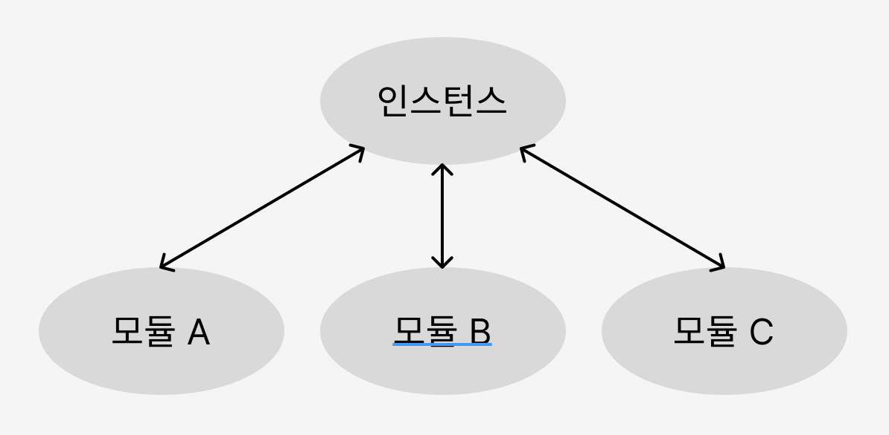

# 디자인 패턴

프로그램을 설계할 때 발생한 문제점들을 객체 간의 상호 관계 등을 이용하여 해결할 수 있도록 하나의 '규약' 형태로 만들어 놓은 것

## 싱글톤 패턴

하나의 클래스에 오직 하나의 인스턴스만 가진다. 보통 데이터베이스 연결 모듈에 많이 사용한다. 하나의 인스턴스를 만들어 놓고 해당 인스턴스를 다른 모듈들이 공유한다.

인스턴스 생성시 비용이 줄어든다는 장점이 있지만, 의존성이 높아진다는 단점이 있다.

> 인스턴스는 일반적으로 실행 중인 임의의 프로세스, 클래스의 현재 생성된 오브젝트를 가리킨다. 객체(오브젝트)의 인스턴스는 데이터베이스나 SGA, 백그라운드 프로세스등 광범위한 컴퓨터시스템 자원의 접근에 할당된 물리 메모리의 일부를 가리킨다.
> 
> [by. Wikipedia](https://ko.wikipedia.org/wiki/%EC%9D%B8%EC%8A%A4%ED%84%B4%EC%8A%A4)



### 자바스크립트의 싱글톤 패턴

아래는 자바스크립트에서 싱클톤 패턴을 구현한 모습이다. 자바스크립트에서는 리터럴 `{}` 또는 `new Object`로 객체를 생성하게 되면 다른 어떤 객체와도 같지 않기 때문에 이 자체만으로 싱글톤 패턴을 구현할 수 있다.

```javascript
const obj = {
  a: 27
}

const obj2 = {
  a: 27
}

console.log(obj === obj2) // false
```

`new Object` 라는 클래스에서 나온 단 하나의 인스턴스니 어느 정도 싱글톤 패턴이라 볼 수 있지만, 실제 싱글톤 패턴은 아래와 같이 구성된다.

```javascript
class Signleton {
  constructor() {
    if (!Signleton.instance) {
      Signleton.instance = this
    }
    return Signleton.instance
  }
  
  getInstance() {
    return this
  }
}

const a = new Signleton()
const b = new Signleton()
console.log(a === b) // true
```

위의 코드는 `Signleton.instance`라는 하나의 인스턴스를 가지는 클래스를 구현한 모습이다. a와 b는 하나의 인스턴스를 가지게 된다.

### 데이터베이스 연결 모듈

싱글톤 패턴은 데이터베이스 연결 모듈에 많이 쓰인다. 데이터베이스 연결시 하나의 인스턴스를 기반으로 하기에 인스턴스 생성 비용을 아낄 수 있다.

### 싱글톤 패턴의 단점

- TDD 할 때 걸림돌이 된다.
  - TDD는 단위 테스트를 주로 하는데, 단위 테스트는 서로 독립적이어야 하며 테스트를 어떤 순서로든 실행할 수 있어야 한다. 반면, 싱글톤 패턴은 미리 생성된 하나의 인스턴스를 기반으로 구현하는 패턴이므로 각 테스트마다 '독립적인' 인스턴스를 만들기 어렵기 때문이다.
- 모듈 간의 결합을 강하게 만들 수 있다.
  - 의존성 주입을 통해 해결할 수 있다.

### 의존성 주입(DI, Dependency Injection)

메인 모듈이 직접 다른 하위 모듈에 대한 의존성을 주기보다는 중간에 의존성 주입자가 이 부분을 가로채 메인 모듈이 간접적으로 의존성을 주입하는 방식이다.

이를 통해 메인 모듈은 하위 모듈에 대한 의존성이 떨어지게 된다. 다른 말로는 `디커플링이 된다` 라고도 한다.

모듈들을 쉽게 교체할 수 있는 구조가 되어 테스팅하기 쉽고 마이그레이션하기도 수월해진다. 애플리케이션 의존성 방향이 일관되고 쉽게 추론할 수 있게 되며, 모듈 간의 관계들이 조금 더 명확해진다는 장점이 있다.

단, 모듈들이 더욱더 분리되어 클래스 수가 늘어나 복잡성이 증가될 수 있으며 약간의 런타임 패널티가 생기기도 한다.

의존성 주입은 **상위 모듈은 하위 모듈에서 어떠한 것도 가져오지 않아야 한다. 또한, 둘 다 추상화에 의존해야 하며, 이때 추상화는 세부 사항에 의존하지 말아야 한다.** 라는 원칙을 지켜주며 만들어야 한다.

---

## 팩토리 패턴

객체를 사용하는 코드에서 객체 생성 부분을 떼어내 추상화한 패턴, 상속 관계에 있는 두 클래스에서 상위 클래스가 중요한 뼈대를 결정하고, 하위 클래스에서 객체 생성에 관한 구체적인 내용을 결정하는 패턴이다.

### 자바스크립트의 팩토리 패턴

간단하게 `new Object()`로 구현할 수 있다.

```javascript
const num = new Object(24)
const str = new Object('abc')
num.constructor.name; // Number
str.constructor.name; // String
```

숫자를 전달하거나 문자열을 전달함에 따라 다른 타입의 객체를 생성한다. 즉, 전달받은 값에 따라 다른 객체를 생성하며 인스턴스의 타입 등을 정한다.

```javascript
class CoffeeFactory {
  static createCoffeee(type) {
    const factory = factoryList[type]
    return factory.createCoffee()
  }
}

class Latte {
  constructor() {
    this.name = 'latte'
  }
}

class LatteFactory extends CoffeeFactory {
  static createCoffee() {
    return new Latte()
  }
}

const factoryList = { LatteFactory }
```

`CoffeeFactory`라는 상위 클래스가 중요한 뼈대를 결정하고 하위 클래스인 `LatteFactory`가 구체적인 내용을 결정하고 있다.

이는 의존성 주입이라고도 볼 수 있다. `CoffeeFactory`에서 `LatteFactory`의 인스턴스를 생성하는 것이 아닌 `LatteFactory`에서 생성한 인스턴스를 `CoffeeFactory`에 주입하고 있기 때문이다.

`static` 키워드를 통해 `createCoffee()` 메서드를 정적 메서드로 선언함으로써 클래스를 기반으로 객체를 만들지 않고 호출이 가능하며, 해당 메서드에 대한 메모리 할당을 한 번만 할 수 있게 된다.

---

## 전략 패턴

정책 패턴이라고도 하며, 객체의 행위를 바꾸고 싶은 경우 직접 수정하지 않고 전략이라고 부르는 **캡슐화한 알고리즘**을 컨텍스트 안에서 바꿔주면서 상호 교체가 가능하게 만드는 패턴이다.

어떤 아이템을 살 때, 카카오페이, 네이버페이 등 다양한 방법으로 결제하듯 결제 방식의 전략만 바꿔서 결제하는 것을 생각하면 된다.

> 프로그래밍에서의 컨텍스트는 상황, 맥락, 문맥을 의미하며 개발자가 어떠한 작업을 완료하는 데 필요한 모든 관련 정보를 말한다.